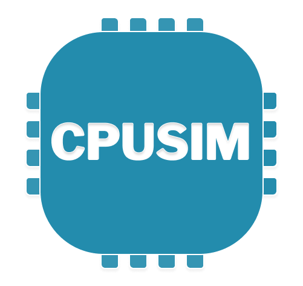

# CPUSim - A Graphical CPU Simulator
CPUSim is an open-source web-based animated x64 CPU simulator for educational purposes.
Provided as a folder for easy distribution and without installation on the Google Chrome Browser.
Powered by [Unicorn.js](https://alexaltea.github.io/unicorn.js/), [Capstone.js](https://alexaltea.github.io/capstone.js/), [Quasar](https://quasar.dev) and [NASM](https://nasm.us).

## Try it!
You can try the simulator [here](https://m0ne.github.io/CPUSim/#/editor).

## Features

- Full NASM x64 assembly syntax support provided by built in NASM assembler
- Visual abstraction of CPU cycle, CPU, registers, flags, memory, bytes, addresses, stack, instruction pointer, stack pointer, base pointer
- Animated step by step execution of the CPU cycle and possibility to skip them each:
    - Get instruction
    - Increment instruction pointer
    - Execute instruction
- Detailed generic animations for basic x64 instructions
- Animated state changes
- Advanced Debugging functionaliy
    - Conditional breakpoints & watchpoints
    - Active line displayed in code viewer
    - Reverse debugging: Step back and forth to replay each CPU cycle
- Visual representation of instructions, stack and base pointer in the memory
- Visual indication of bytes belonging to the current instruction and future instructions or stack
- Visual indication of which memory bytes were accessed by the simulator
- Change log to keep track of past instructions and changes in register and memory values
- Code editor with syntax highlighting and assembler feedback
- Selection of demo programs
- Modern, responsive design
- Packed into a self-sustained web application
    - Multiplatform
    - No installation required
    - Deliverable over email, file sharing or simple HTTP server
    - Works offline

## Build instructions

Clone this repository and follow the instructions in [x86/README.md](x86/README.md)

## License

Licenced under SPDX-License-Identifier: [GPL-2.0-only](COPYING)

## Copyright

[Dependencies Copyright Notice](LICENSE)

Copyright © 2021 by Eliane Schmidli and Yves Boillat

Modified 2022 by Michael Schneider and Tobias Petter

